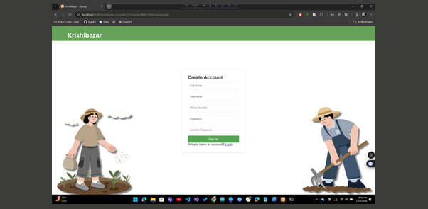

# 🌾 Krishi Bazaar – A Web-Based Agricultural Marketplace

## 📌 Project Overview
**Krishi Bazaar** is a web-based digital marketplace designed to bridge the gap between farmers and consumers by enabling seamless buying and selling of agricultural products. The platform promotes transparency, efficiency, and direct communication, allowing customers to receive fresh produce directly from verified sellers.

This project was developed as a **group project for the Web Technology course**, following a collaborative development approach using Git and GitHub.

---

## 🎯 Purpose
The primary objective of Krishi Bazaar is to:
- Empower farmers by providing them with a digital platform to sell products directly
- Enable customers to conveniently browse and purchase fresh agricultural goods
- Allow administrators to efficiently manage users, products, and transactions
- Demonstrate practical implementation of a role-based web application

---

## 👥 User Roles & Functionalities

### 🛡️ Admin Panel
Admins act as platform supervisors, ensuring security, quality, and smooth system operation.

**Key Features:**
- View real-time platform statistics (users, sellers, products, orders)
- Manage user accounts (block/unblock sellers and customers)
- Moderate product listings (approve/remove products)
- Monitor all orders and transactions
- Track system activities through activity logs

📽️ *Admin Panel Preview*  

---

### 🌱 Seller Dashboard
Sellers are the core contributors who supply agricultural products and manage business operations.

**Key Features:**
- Seller profile management with business and contact details
- Product management (add, update, remove products and pricing)
- Inventory control to manage stock availability
- Order handling with status updates (pending, shipped, delivered)
- Sales analytics for revenue and performance tracking

📽️ *Seller Dashboard Preview*  

---

### 🛒 Customer Interface
Customers interact with the platform to purchase products easily and securely.

**Key Features:**
- Browse and search products by category
- Add products to cart and place orders
- Manage and track orders in real time

📽️ *Customer Interface Preview*  

---

## 📷 Project Screenshots
A complete visual walkthrough of the system interfaces is available below:

👉 **[View Project Screenshots](screenshots/)**

---

## 🧑‍💻 Technologies Used
- HTML, CSS, JavaScript
- PHP
- MySQL
- AJAX 
- JSON

---

## 🤝 Team Contributions
This project was collaboratively developed by a group of three members. Each member was responsible for implementing a specific role-based module of the system. All modules were later merged into a single, integrated application using Git.

| Team Member | Responsibility |
|------------|----------------|
| **Diamond Halder** | Seller module implementation (Seller dashboard, product & inventory management) |
| **Ayesha Khatun** | Admin module implementation (User management, product moderation, system monitoring) |
| **Rupam Debnath Rodra** | Customer module implementation (Product browsing, cart, order management) |

---

## 🔀 Collaboration & Version Control
- Individual modules were developed separately by each team member
- Git branching and merging strategies were used to integrate all features
- Final integration ensured smooth interaction between Admin, Seller, and Customer modules

---

## ✅ Key Highlights
- Fully role-based access control system
- Secure user authentication and authorization
- Real-time order tracking and inventory handling
- Clean, user-friendly interface
- Collaborative development using GitHub

---

## 📌 Conclusion
Krishi Bazaar showcases how modern web technologies can enhance agricultural commerce by directly connecting farmers with consumers. The project reflects strong teamwork, structured system design, and practical application of web development concepts learned throughout the course.

---

**Developed by:**  
Diamond Halder  
Rupam Debnath Rodra  
Ayesha Khatun  

**Course:** Web Technology  
**Project Type:** Group Project
